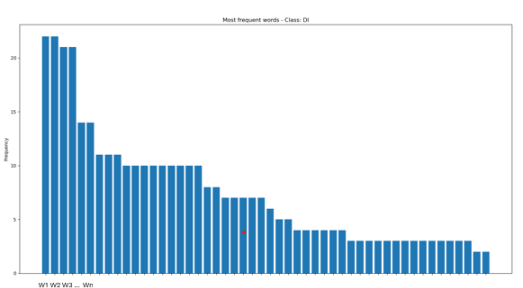
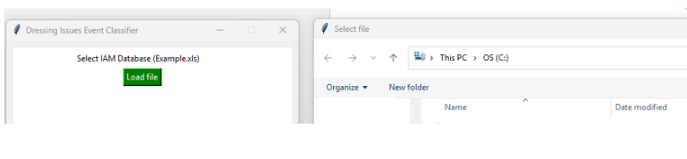
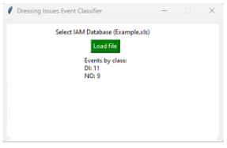
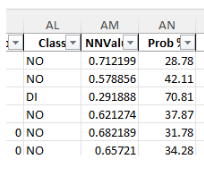

# 🧠 Python Quality Event Classification App | NLP & Machine Learning GUI Tool

## 🚀 Overview
This project presents a **Python-based desktop application** that uses **Artificial Intelligence / Machine Learning** to classify **quality events** and identify which records are associated with **data entry** and **order loading errors**.

The solution combines **Natural Language Processing (NLP)**, **Machine Learning classification**, and a **Tkinter GUI** to automate event screening, improve **data quality analytics**, and support faster operational decision-making.

---

## 🎯 Business Context
In industrial and operational environments, quality event logs often contain unstructured textual descriptions that make manual review slow, inconsistent, and error-prone.

This project was developed to:
- Automate the classification of **quality events**
- Detect events related to **data entry and order loading errors**
- Reduce manual effort in event screening
- Improve **data quality monitoring** and analytical consistency
- Support faster and more reliable decision-making

---

## ⚠️ Data Disclaimer
The original business dataset is not included for confidentiality reasons.

This repository demonstrates:
- The **NLP preprocessing pipeline**
- The **Machine Learning modeling approach**
- The **classification workflow**
- The **desktop application interface**
- The **analytical output design**

---

## 🏗️ Solution Architecture
The application follows an **end-to-end Machine Learning workflow**:

1. Text preprocessing for training and inference datasets  
2. Feature engineering and vectorization  
3. Model benchmarking across multiple classification algorithms  
4. Neural Network model selection  
5. Desktop deployment using **Tkinter**  
6. Analytical output generation for business users  

---

## 🧹 NLP Preprocessing Pipeline
A full **text preprocessing pipeline** was built for both training and inference datasets, including:

- **Lemmatization**
- **Text normalization**
  - Accent / diacritics handling
  - Uppercase / lowercase normalization
- **Stopwords removal**
- **Train/Test split** for validation
- **Label encoding** using `LabelEncoder()`
- **Text feature extraction** using `CountVectorizer`
- **Input feature normalization**

This pipeline improved text consistency and enabled robust **NLP-based classification**.

---

## 🤖 Machine Learning Models
Using a curated dataset of 100 quality events selected to cover the highest-probability cases by region and error type, the project benchmarked several **Machine Learning models**:

- **Random Forest**
- **Support Vector Machine (SVM)**
- **Logistic Regression**
- **Naive Bayes**
- **Artificial Neural Network**

---

## 🧠 Selected Neural Network Architecture
The best-performing model was a **Neural Network**, configured as follows:

- `Dense(100, activation='relu')`
- `Dense(40, activation='relu')`
- `Dense(1, activation='sigmoid')`

Training setup:
- `optimizer='Adam'`
- `loss='binary_crossentropy'`

This model delivered the strongest overall performance for identifying positive quality-event cases.

---

## 📊 Feature Analysis & Visualization
The application also provides analytical visibility into the processed event descriptions.

### Histogram Visualization
A histogram was included to show the distribution of detected words / features extracted from the input dataset.

---

## 🖥️ Desktop GUI Tool
A **desktop GUI** was developed using **Tkinter**, allowing business users to upload an event extract and run the trained classification model without needing to interact directly with code.

### Main Interface

### Results Interface
The interface returns key analytical outputs, including:
- Total number of detected events
- Classification results summary

---

## 📤 Enriched Output File
The application generates an **enriched output dataset** from the same user-uploaded input file, adding the following analytical fields:

- **Binary flag** (positive / negative classification)
- **Neural network score / value**
- **Probability of being a positive case**

This output supports downstream analysis and operational review.

---

## 📈 Key Features
- **Python-based Machine Learning application**
- **Natural Language Processing (NLP) pipeline**
- **Quality event classification**
- **Text preprocessing and normalization**
- **Feature extraction with CountVectorizer**
- **Label encoding and input normalization**
- **Model benchmarking across multiple ML algorithms**
- **Neural Network binary classification**
- **Desktop GUI deployment with Tkinter**
- **Automated enriched output generation**
- **Data Quality Analytics support**

---

## 🧪 Methodology
The project followed a structured **Machine Learning and NLP workflow**:

1. Collection and curation of representative event descriptions  
2. Text preprocessing and cleaning  
3. Label encoding and text vectorization  
4. Train/Test split for model validation  
5. Benchmarking of multiple classification models  
6. Selection of the best-performing model  
7. GUI integration for user-facing deployment  
8. Analytical output generation and visualization  

---

## 🏆 Results
The **Neural Network** achieved the best overall performance among the evaluated models.

The final solution enabled:
- Accurate classification of relevant quality events
- Clear scoring and probability outputs
- Faster identification of events associated with **data entry** and **order loading errors**
- Practical usability through a desktop application

---

## 💼 Business Impact
- Reduced manual effort in event classification  
- Improved consistency in **quality event screening**  
- Enabled faster detection of cases related to **data entry and loading errors**  
- Supported **data-driven quality analysis**  
- Delivered a practical AI tool for operational users  

---

## 🛠️ Tech Stack
- **Python**
- **Machine Learning**
- **Natural Language Processing (NLP)**
- **Classification Modeling**
- **Neural Networks**
- **scikit-learn**
  - `LabelEncoder`
  - `CountVectorizer`
- **Data Normalization**
- **Model Benchmarking**
- **Tkinter**
- **Data Quality Analytics**

---

## 📌 Key Skills Demonstrated
- **Python Development**
- **Machine Learning Classification**
- **Natural Language Processing**
- **Text Preprocessing**
- **Feature Engineering**
- **Model Evaluation & Benchmarking**
- **Neural Network Modeling**
- **Desktop Application Development**
- **Data Quality Analytics**
- **Operational AI Deployment**

---

## 🔮 Future Improvements
- Expand the training dataset to improve model generalization  
- Incorporate more advanced NLP techniques (e.g., embeddings / transformer-based models)  
- Add explainability features for classification decisions  
- Deploy as a web-based application for broader adoption  
- Integrate with enterprise reporting pipelines and dashboards  

---

## 📄 Notes
This project demonstrates the application of **Artificial Intelligence, Machine Learning, and NLP** to solve real business challenges in **quality analytics**, combining **text classification, automation, and user-facing deployment** in a practical desktop tool.
